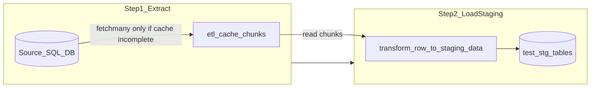

# ETL extract-to-cache for SQL pipelines

## Scope (confirmed)

- **In scope**: Python orchestrator pipelines that read from SQL Server source DB via [`TemplatePipeline`](src/orchestrator/pipelines/pipeline_template.py) and [`SalesTemplatePipeline`](src/orchestrator/pipelines/sales_template.py):
  - Factory Inventory, Distributor Inventory, Target, Sales Snapshot
- **Out of scope**: [`DistributorDeliveriesPipeline`](src/orchestrator/pipelines/distributor_deliveries.py) (Dropbox/Excel), SQL-only orchestration (`etl_usp_run_*` / `etl_usp_load_stage_*`)

## Problem today

`load_stage()` runs extract and staging insert in one tight loop in `_extract_and_load_batches`:

```216:241:src/orchestrator/pipelines/pipeline_template.py
    def _extract_and_load_batches(self, extract_query: str, batch_size: int) -> None:
        ...
        with self._connection_factory.connection('source') as source_conn:
            ...
            while True:
                rows = source_cursor.fetchmany(batch_size)
                ...
                self._load_batch_to_staging(batch_data, insert_query, batch_count)
```

If staging insert fails on batch _N_, a retry re-queries the entire source dataset. Source queries are typically the slow, fragile step.

## Target flow



**Retry behavior**: If cache manifest is `EXTRACT_COMPLETE`, skip source connection entirely and only run Step 2.

## Design

### 1. New module: extract cache utilities

Add [`src/orchestrator/pipelines/utils/extract_cache.py`](src/orchestrator/pipelines/utils/extract_cache.py):

| Responsibility | Detail                                                                                                                        |
| -------------- | ----------------------------------------------------------------------------------------------------------------------------- |
| Cache root     | `{project_root}/data/etl_cache/` (configurable via optional `cache_dir` ctor param on pipeline)                               |
| Cache path     | `{batch_type}/{batch_id}/` — ties cache to a specific batch run for safe reruns                                               |
| Chunk files    | `chunk_0001.pkl`, `chunk_0002.pkl`, ... (pandas `to_pickle` / `read_pickle` — no new dependency; pandas already used in repo) |
| Manifest       | `manifest.json`: `status`, `extract_query_hash`, `row_count`, `column_names`, `chunk_files`, `created_at`                     |
| Status values  | `EXTRACTING` → `EXTRACT_COMPLETE` → `LOAD_COMPLETE`                                                                           |

**Cache validity**: On extract start, write manifest with `extract_query_hash` (SHA-256 of final SQL + filter params: `since_date`, `snapshot_date`, `single_date_only`, pipeline `batch_type`). If manifest exists with matching hash and `EXTRACT_COMPLETE`, skip extract.

**Flags on `load_stage`** (backward compatible defaults):

- `use_cache: bool = True` — enable checkpointing
- `force_extract: bool = False` — delete cache dir and re-query source
- `extract_only: bool = False` — run Step 1 only (CLI “Extract” layer)
- `load_from_cache_only: bool = False` — run Step 2 only; error if cache not complete

**Retention (default when not specified by user)**: Delete cache directory after staging load succeeds (`LOAD_COMPLETE`). Keeps disk clean; retries work while a run is in progress or after a failed load (manifest stays at `EXTRACT_COMPLETE`). Document `force_extract` and manual delete of `data/etl_cache/` for intentional re-extract.

Add `data/etl_cache/` to [`.gitignore`](.gitignore).

### 2. Refactor `TemplatePipeline`

Split [`pipeline_template.py`](src/orchestrator/pipelines/pipeline_template.py):

| Method                                                        | Purpose                                                                              |
| ------------------------------------------------------------- | ------------------------------------------------------------------------------------ |
| `_extract_to_cache(extract_query, batch_size, force_extract)` | Source cursor `fetchmany` → pickle chunks; atomic manifest update                    |
| `_load_cache_to_staging(batch_size)`                          | Read chunks → `transform_row_to_staging_data` → `_load_batch_to_staging`             |
| `_extract_and_load_batches(...)`                              | Thin orchestrator: extract (if needed) then load; preserve KeyboardInterrupt cleanup |

Update `load_stage()` to call the split flow and accept the new flags.

[`SalesTemplatePipeline.load_stage`](src/orchestrator/pipelines/sales_template.py) already overrides `load_stage` but still calls `_extract_and_load_batches` — no override needed if the split lives in the base method; rolling-window query building stays as-is.

**Interrupt handling**: On `KeyboardInterrupt` during extract, remove incomplete cache dir (or mark manifest failed). On interrupt during load, keep `EXTRACT_COMPLETE` cache so retry can resume staging only (existing `_cleanup_partial_staging_data` still deletes partial staging rows for `batch_id`).

### 3. CLI: separate layers for SQL pipelines

Update [`scripts/pipeline_cli.py`](scripts/pipeline_cli.py) menu for Factory Inventory, Distributor Inventory, Sales Snapshot, Target:

- **Extract to cache** — `load_stage(extract_only=True, ...)`
- **Load staging from cache** — `load_stage(load_from_cache_only=True, ...)`
- **Load stage (full)** — current behavior (both steps, uses cache when present)
- Optional prompt: “Force re-extract from source?” when running extract/full

Publish layer unchanged.

### 4. Tests

Update outdated unit tests in [`tests/pipelines/test_factory_inventory.py`](tests/pipelines/test_factory_inventory.py) (they still mock old stored-proc `load_stage`).

Add focused tests for `extract_cache.py` and `TemplatePipeline` with mocked connections:

- Extract writes manifest + chunks
- Second call with same query skips source fetch
- `force_extract=True` re-queries source
- `load_from_cache_only=True` without cache raises clear error
- Staging failure leaves cache at `EXTRACT_COMPLETE` for retry

## Files to touch

| File                                                | Change                                      |
| --------------------------------------------------- | ------------------------------------------- |
| `src/orchestrator/pipelines/utils/extract_cache.py` | **New** — cache I/O, manifest, path helpers |
| `src/orchestrator/pipelines/utils/__init__.py`      | Export cache helpers if needed              |
| `src/orchestrator/pipelines/pipeline_template.py`   | Split extract/load; new `load_stage` params |
| `scripts/pipeline_cli.py`                           | New menu options for SQL pipelines          |
| `.gitignore`                                        | Ignore `data/etl_cache/`                    |
| `tests/pipelines/test_factory_inventory.py`         | Align with Python extract/load behavior     |
| `tests/pipelines/test_extract_cache.py`             | **New** — cache utility tests               |

## Out of scope (explicit)

- Dropbox/Excel [`DistributorDeliveriesPipeline`](src/orchestrator/pipelines/distributor_deliveries.py)
- T-SQL `etl_usp_load_stage_*` procedures (different runtime; would need BCP/temp tables on SQL Server)
- DB schema changes to `ctl_BatchRun` (optional future: persist step status in `source_watermarks` JSON)

## Example retry workflow

1. Run **Load stage (full)** → extract completes, staging fails on batch 50.
2. Fix DB issue (permissions, timeout, etc.).
3. Run **Load staging from cache** with same `batch_id` → reads pickle chunks only; re-deletes/reloads staging for that `batch_id` via existing `_prepare_staging_table`.
4. Run **Publish** as today.

Or use **Load stage (full)** for step 3 — it will detect `EXTRACT_COMPLETE` and skip source automatically.
